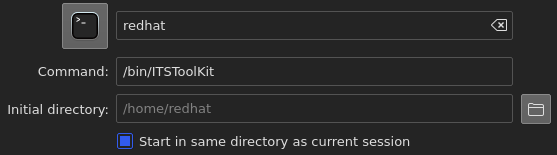
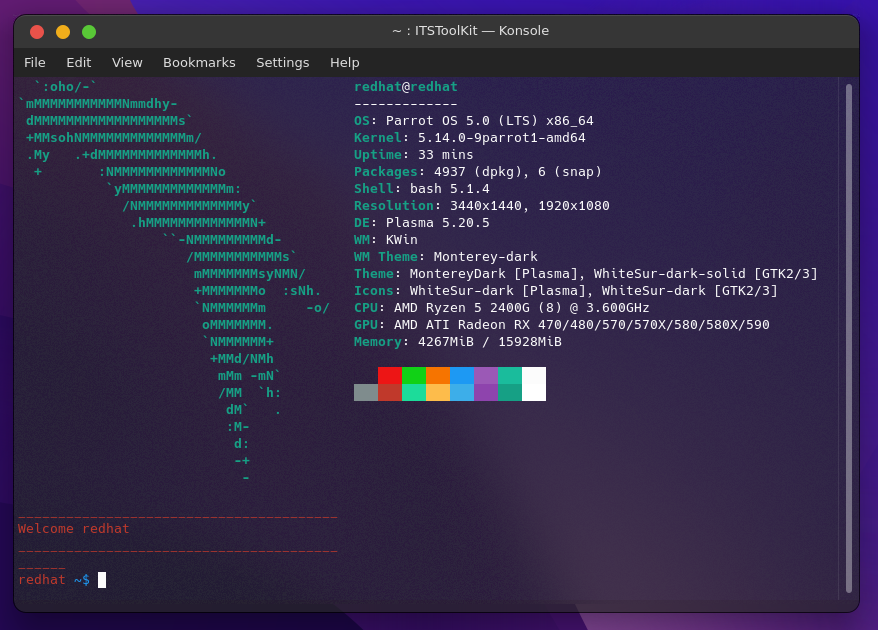

The requirements for this toolkit is that you have installed all the requirements in 
If they are not installed the toolkit might still work, but not optimal, some functions and commands will be unusable.

You also need to either run the AptInstaller, brew installer or PacmanInstaller (Depending on which OS and flavor of linux you have.) Or move the "ITSToolKit.py" and "ITSToolKit" files to /bin/. 

With any popular Terminal Emulator, there should be a settings or profile tab, as seen below;

Some Terminal Emulators like the MATE Terminal might have the profile / settings tab in the edit category like show below; 

But this tutorial will go over the Konsole- Terminal.

When we open the settings category, and press on "edit current profile", you will see a "general" tab first.
In there, there should be a entry filed with the name of "Command:" and then it can say, "bin/bash", "bin/zsh", "bin/fish" etc.

In the "Command:" entry box, we want to change that "/bin/bash/" to "/bin/ITSToolKit", because then it will run the script "ITSToolKit" instead of bash.
As said at the top of the tutorial, the "ITSToolKit" bash file and the "ITSToolKit.py" needs to be in /bin/, so the files are in the same place and so the bash script can execute the python script fast.

When you have done the step of replacing "/bin/bash" with "/bin/ITSToolKit" it should look something like this, in the general tab;

And something like this, when you open Konsole (Or any other terminal that you did this to);

And then you are done with the steps of making it the startup script.

If you want to temporarily use bash or zsh without changing "/bin/ITSToolKit" back to "/bin/bash/" or "/bin/zhs" you can type "bash" in the terminal, and your normalt bash terminal should appear, then you can type "exit" and it will return the ITSToolKit terminal. 
