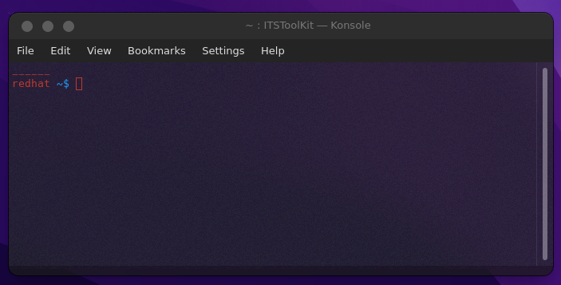
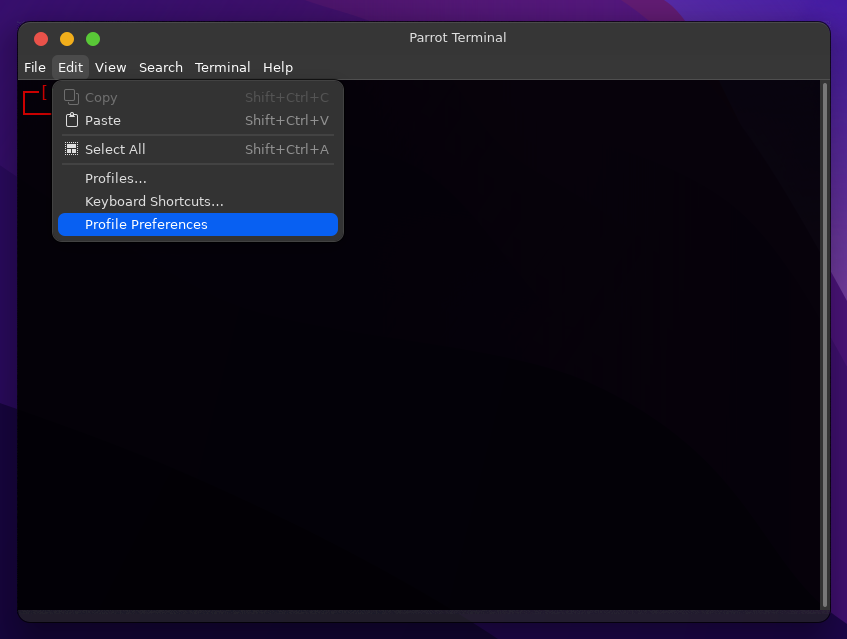
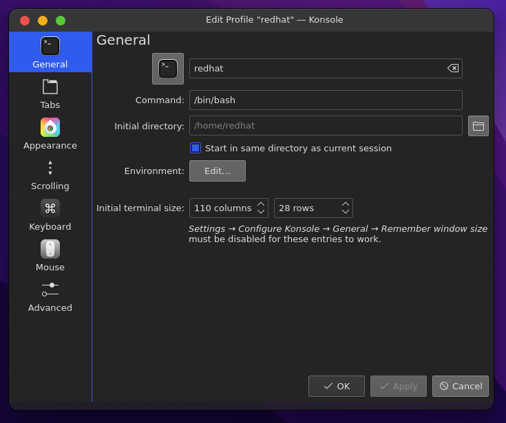

The requirements for this toolkit is that you have installed all the requirements in 
If they are not installed the toolkit might still work, but not optimal, some functions and commands will be unusable.

With any popular Terminal Emulator, there should be a settings or profile tab, as seen below;

Some Terminal Emulators like the MATE Terminal might have the profile / settings tab in the edit category like show below; 

But this tutorial will go over the Konsole- Terminal.

When we open the settings category, and press on "edit current profile", you will see a "general" tab first.
In there, there should be a entry filed with the name of "Command:" and then it can say, "bin/bash", "bin/zsh", "bin/fish" etc.

