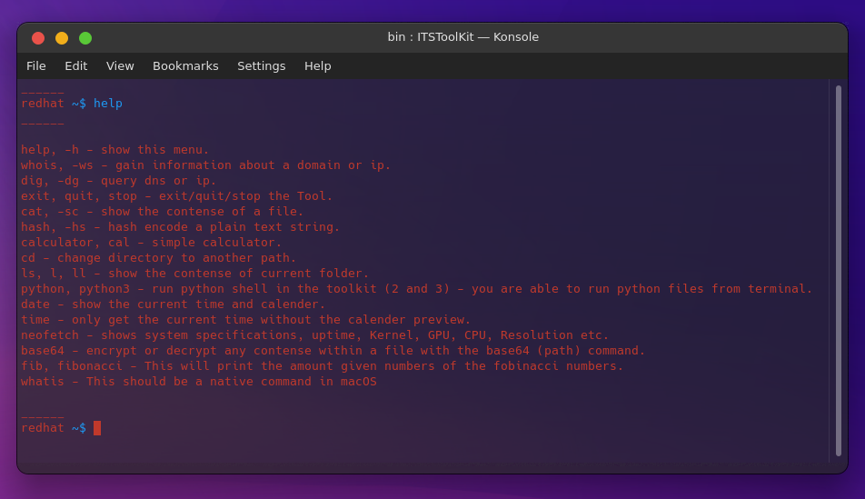
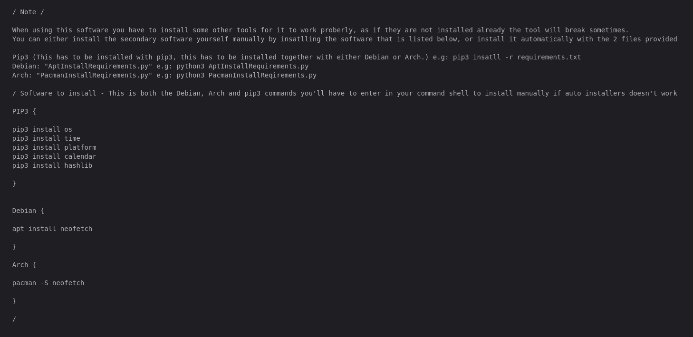

# ITSToolKit
This is the Indian Tech Support Tool Kit "ITSToolKit" Click here to go to the v1.080 release, this is the first stable build tested on multiple operating systems, and different hardware; Click here to go to download .
This toolkit uses python 3.10, you can't use any other version because it's using the new match "case" in python 3.10 
If you want to use the toolkit by just typing "ITSToolKit" add the ITSToolKit.py and ITSToolKit.sh to /bin/ folder.
You can either do that manually or use the AptInstaller.py or PacmanInstallerReq.py (Depending on Distribution ) file to it automatically for you, and also install all the requirements for the toolkit.

Thanks for using and enjoy the tool kit.

Autostart help


Future updates {

Adding an update command or file so you can easily get the newest version of the ToolKit, and don't have to manually download the script and run the Apt installer.

}


Instructions for installing (CLI)
```
git clone https://github.com/CollinEdward/ITSToolKit.git
cd ITSToolKit
python3 AptInstaller.py or python3 PacmanInstallerReq.py
```


for instructions on installing python 3.10 on linux systems click on:
```
https://computingforgeeks.com/how-to-install-python-on-ubuntu-linux-system/
```

Preview for toolkit





Can also be found 

